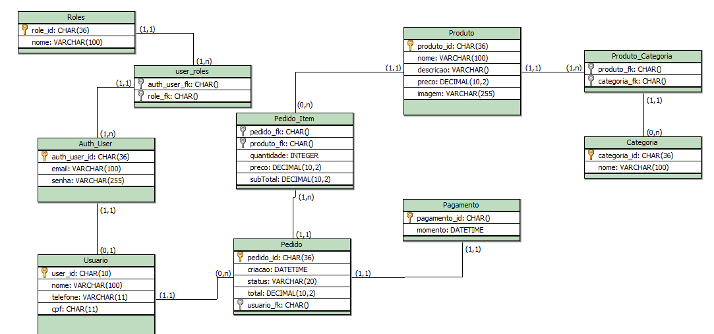

# 🛒 E-commerce API

Este projeto é uma **API REST de E-commerce** desenvolvida em **Java com Spring Boot**, focada em boas práticas de arquitetura, segurança com **OAuth2 + JWT**, e modelagem de dados relacional bem definida.

A aplicação cobre desde **autenticação/autorização**, **gestão de usuários**, **produtos**, **categorias**, até **pedidos**.

---

## 🚀 Tecnologias Utilizadas

* **Java 21**
* **Spring Boot**
* Spring Web
* Spring Data JPA / Hibernate
* Spring Security
* OAuth2 Resource Server (JWT)
* **PostgreSQL**
* **Flyway**
* Swagger Open API
* Docker

---

## 🧱 Arquitetura do Projeto

O projeto segue uma arquitetura em camadas:

```
controller  →  service  →  repository  →  database
```

Além disso, há separação clara entre:

* **Auth_User**: autenticação e autorização
* **Usuario**: dados de domínio do usuário

---

## 🔐 Segurança

* Autenticação baseada em **JWT**
* OAuth2 Resource Server
* Roles (ex: `ROLE_ADMIN`, `ROLE_USER`)
* Separação entre credenciais e dados do usuário

Fluxo resumido:

1. Usuário autentica
2. Recebe um JWT
3. Token é enviado no header `Authorization: Bearer <token>`
4. A API valida o token e aplica as permissões

---

## 🗄️ Modelagem de Dados

Abaixo está a modelagem relacional utilizada no projeto:
<p align="center">
  
</p>

---

## 📦 Funcionalidades

* ✅ Autenticação e autorização
* ✅ Criação de Usuario
* ✅ Cadastro e listagem de produtos
* ✅ Associação de produtos a categorias
* ✅ Criação de pedidos
* ✅ Listagem de pedidos por usuário logado

---

## 🧪 Boas Práticas Aplicadas

* Uso de **DTOs** para entrada e saída
* Validações nos DTOs
* Transações controladas com `@Transactional`
* Queries derivadas do Spring Data JPA
* Evita exposição direta das entidades

---

## 🛠️ Banco de Dados & Migrations

O versionamento do banco é feito com **Flyway**.

Exemplo:

```
src/main/resources/db/migration
├── V1__create_tables.sql
├── V2__insert_roles.sql
```

---

▶️ Como Executar o Projeto

# 🐳 Banco de Dados com Docker

O projeto utiliza **PostgreSQL via Docker**, permitindo executar a aplicação sem instalar o banco de dados localmente.

---

## ✅ Pré-requisitos

- Docker
- Docker Compose
- Java 21

---

## ⚙️ Configuração

1. Clone o repositório:

```bash
git clone https://github.com/elder-lima/ecommerce-backend.git
cd ecommerce-backend
```

2. Crie um arquivo .env na raiz do projeto com base no .env.example:

```bash
POSTGRES_DB=ecommerce_db
POSTGRES_USER=your_user
POSTGRES_PASSWORD=your_password
```

🚀 Subindo o banco de dados

Execute:

```bash
docker compose up -d
```

3. Configure o banco de dados no `application.properties` com base no `application-example.properties`
4. Rode a aplicação:

```bash
mvn spring-boot:run
```

---

**<h3>📚Projeto com foco em aprendizado, boas práticas e arquitetura backend.</h3>**
